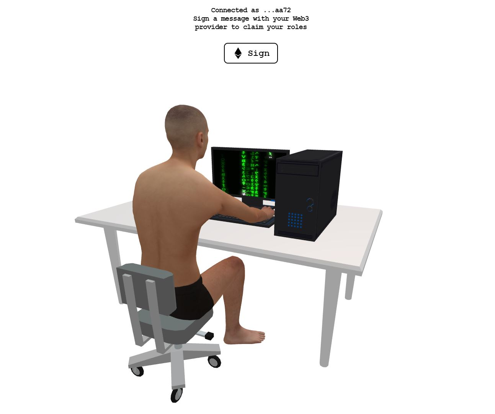

<p align="center">
  <br />
  
</p>

# mannys-game-roles

This application uses `next-auth` in conjuction with `ethers` and `react-three-fiber` to create a 3D scene where owners of mannys.game NFTs can connect their wallet to claim Discord roles.

## Getting Started

### 1. Clone the repository and install dependencies

```
git clone https://github.com/mannynotfound/mannys-game-roles.git
cd mannys-game-roles
npm install
```

### 2. Configure your local environment

Copy the .env.local.example file in this directory to .env.local (which will be ignored by Git):

```
cp .env.local.example .env.local
```

Add details for one or more providers (e.g. Google, Twitter, GitHub, Email, etc).

### 3. Start the application

To run your site locally, use:

```
npm run dev
```

To run it in production mode, use:

```
npm run build
npm run start
```

### 5. Preparing for Production

You must set the `NEXTAUTH_URL` environment variable with the URL of your site, before deploying to production.

e.g. in your `.env.local` file - `NEXTAUTH_URL=https://example.com`

To do this with Vercel, you can use the [Vercel project dashboard](https://vercel.com/dashboard) or their cli via the `vc env` command:

```
vc env add NEXTAUTH_URL production
```

Do not forget to set the environment variables for the Client ID and Client Secret values for all your configured authentication providers in your hosting providers dashboard, i.e. with Vercel as described above.
